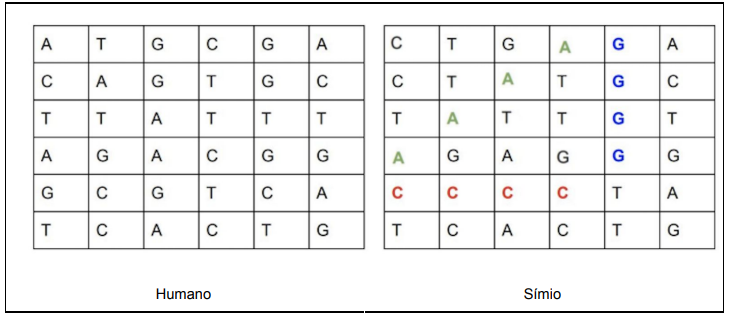
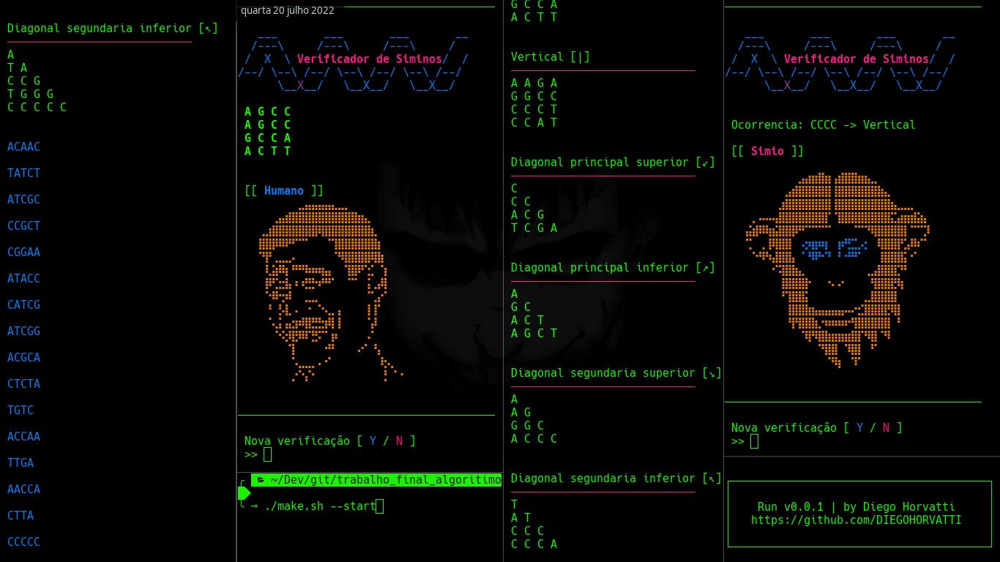

### Trabalho final de algoritimo
#### Aluno: Diego Horvatti
#### Professor: Manasses ribeiro

 
<a  align="center" href="./relatorio.md">

Relatório

</a>

Desafio de Programação

Instruções gerais
Resolver o problema abaixo seguindo, obrigatoriamente, as regras

  1) Utilizar vetores e/ou matrizes dinâmico (ponteiros);

  2) Utilizar estruturas de repetição;

  3) Implementar utilizando modularização (no mínimo um módulo de procedimento e dois módulos de ação);

  4) Utilizar passagem de parâmetro por valor e referência. É proibido usar variável global!;

  5) Utilizar registros;

  6) Utilizar alocação dinâmica de memória;

  7) Trabalho individual.

* OBS 1: Apresentar, além do código, pequeno relatório descrevendo, em detalhes, o método (metodologia) utilizado para resolver o problema. O relatório deverá conter um resumo entre 400 e 700 palavras, figuras e gráficos que demonstrem a resolução e resultados obtidos. Importante: os resultados devem ser discutidos e não apenas apresentados.

* OBS 2: Apresentação/entrega até no máximo dia 14/07/2022 (último dia de aula).

Problema (desafio) Símios:
Em um futuro distante, na cadeia evolutiva, os símios e os humanos estão cada vez mais próximos. Por esse motivo é muito difícil distinguir quem é humano e quem é símio. Você é um cientista contratado para desenvolver um projeto que detecta se uma sequência de DNA pertence a um humano ou a um símio. Para isso, você precisar desenvolver um programa, com um método ou função com a seguinte assinatura em C:

int isSimian (char[] dna); // Exemplo da assinatura em C

Você receberá como parâmetro um array de char (string) que representa cada linha de uma tabela (matriz) quadrada de (NxN) com a sequência de DNA, como no exemplo abaixo:

As letras da string só podem ser: (A, T, C, G), que representa cada base nitrogenada do DNA.

Você saberá se um DNA pertence a um símio, se encontrar uma ou mais sequências de quatro letras iguais nas direções horizontais, verticais ou nas diagonais. Exemplo (Símio):

char dna[] = {"CTGAGACTATGCTATTGTAGAGGGCCCCTATCACTG"};

Nesse caso, a chamada para a função isSimian(char[] dna) deve retornar 1 ("true").

Com base nessas informações, desenvolva o algoritmo da maneira mais eficiente possível, de acordo com a assinatura proposta isSimian(char[] dna), que seja capaz de identificar corretamente símios.

Exemplos de arquivos texto com a sequência de DNA tanto dos <a href="./src/exemplo_arquivo_sequencia_DNA_humano.txt">humanos</a> quanto dos <a href="./src/exemplo_arquivo_sequencia_DNA_simios.txt">símios</a> podem ser encontrados nos hyperlinks.

O que entregar
  - Código-fonte em C
  - Criar um repositório privado no Github
    * Após finalizar o teste adicionar o usuário manassesribeiro (manasses.ribeiro@ifc.edu.br) como colaborador para que possamos ter acesso ao código;

      * Se o repositório estiver público, será automaticamente desqualificado (e a nota zerada).

      * Instruções sobre como executar o programa ou a API (no arquivo README)

      * OBS: lembre-se que o programa deve ter interface de uso que facilite o carregamento das sequências

  - Relatório técnico descrevendo a metodologia utilizada para resolver o problema, conforme descrito na OBS 1

- Observações:
  * Tenha em mente que faremos uma série de testes com matrizes válidas e inválidas.
  * Considere a performance do algoritmo e o tempo de resposta da aplicação.

 
