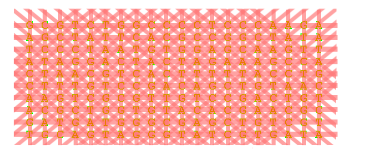
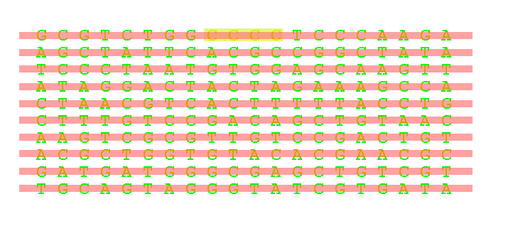
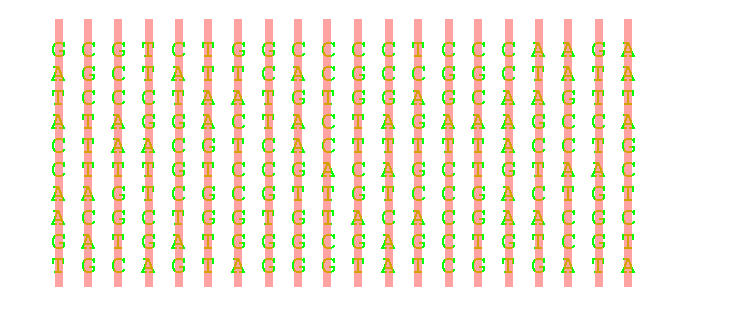
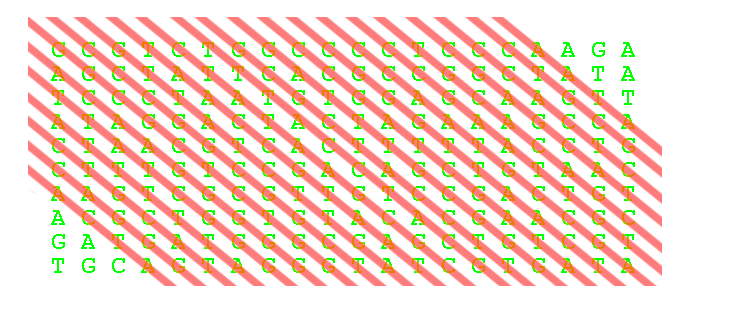
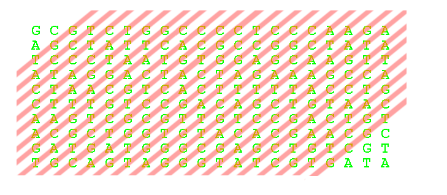
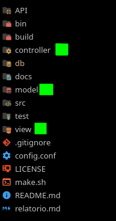
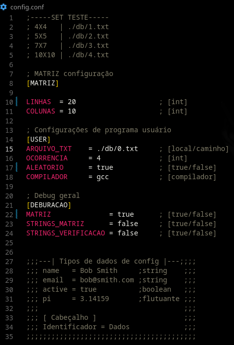
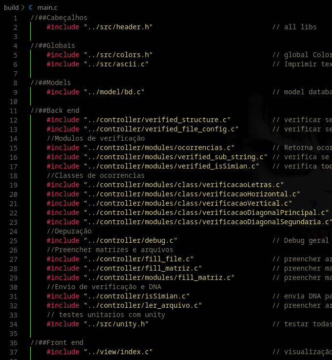
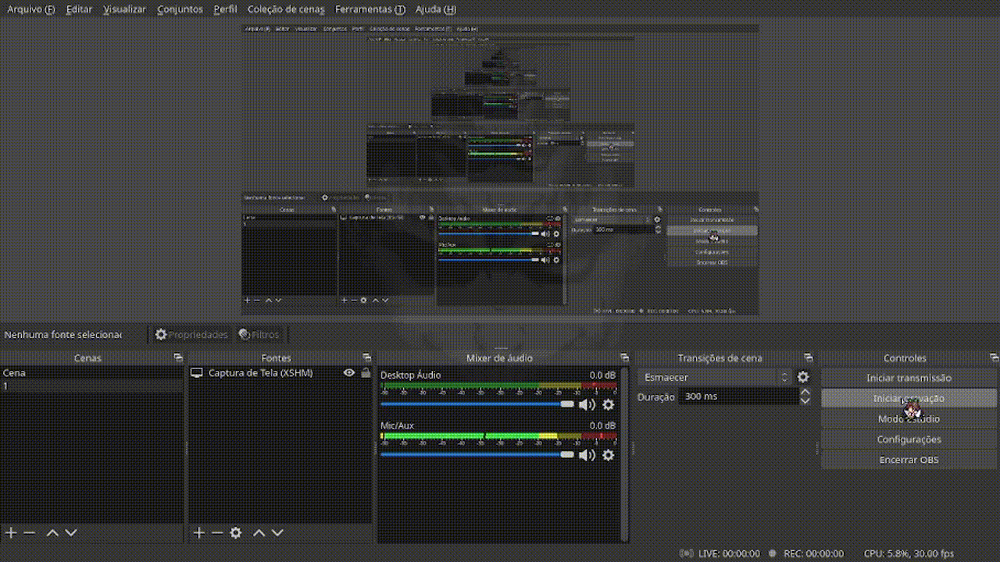

Percorrer cada Linha possível da matriz e procurar ocorrências sequidas de bases nitrogenadas.
 

 
Para responder à questão em si, eu desmembrei a matriz em string´s, e com 4 processos de verificação distintos['horizontal', 'vertical', 'Diagonal Principal', 'Diagonal Segundaria'], para percorrê-las verificando se existe uma sub string com a função "strstr(stringPercorrido, ocorrência)" se sim, retorna 1, Com está lógica eu verifico os vetores horizontais e caso ainda retorne 0  vai para a verificação vertical depois as diagonais principais e por último as diagonais segundarias. 

 Horizontal 

 

 Vertical 

 

 Diagonal principal 

 

 Diagonal Segundaria 

 

Na parte estrutural do programa eu usei a arquitetura de projeto MVC, Com testes unitários TDD
 

 
 

Para fazer a configuração geral usei o consumo de API para leitura se arquivos de configuração ".conf" https://github.com/benhoyt/inih
 

 
 

Na compilação fiz de forma síncrona assim os arquivos de baixo receberam com perfeição os métodos e procedimentos dos arquivos de cima
 

 
 

Já no front-end após eu 'penar' um pouquinho consegui fazer um front end até que agradável
 

 

Debug das matrizes da sala de aula

 

 

NOTAS DE PROGRAMAÇÃO

Algo muito importante no trabalho é  a função do tipo de dado struct contido no "model" com ele foi bem legal ficar alterando os dados ao decorrer do programa.  
Outra coisa interessante é a possibilidade de o programa criar matrizes dinâmicas e randômicas caso for especificado no arquivo de configuração "ALEATORIO" como 'true' com isso ele criará uma matriz de DNA aleatória com as linhas e colunas do arquivo de configuração.
 

 

Como no exemplo acima na verdade a verificão das diagonais principais e segundarias ele é repartido pela metade ['Diagonal principal Superior', 'Diagonal principal inferior'] assim na verdade temos 6 verificações e não 4 porem como está na mesma função englobando as duas é como se fosse uma.
 
Outra coisa importante destacar é que só é passado a string para verificação se a mesma atender a alguns requisitos
* Ter o tamanho de caracteres igual ou maior que o setado em OCORRENCIAS no arquivo de configuração
* Não ter caracteres que não fazem parte das bases nitrogenadas['A', 'T', 'C', 'G']
* quando a primeira ocorrência for achada na ordem ['Horizontal', 'Vertical', 'Diagonal Principal', 'Diagonal segundaria'] o programa encerrará 
* caso não encontre nem uma ocorrência em, nem uma das verificações ele retornará humano
 
  
 